## Create React App with Router

```
npx degit remix-run/react-router/examples/basic my-react-app
npm i
npm build
```

## Create AWS S3 Bucket

https://s3.console.aws.amazon.com/s3/bucket/create

Just leave all the things default, because we want to keep bucket "private" and only allowed to be accessed by CloudFront.

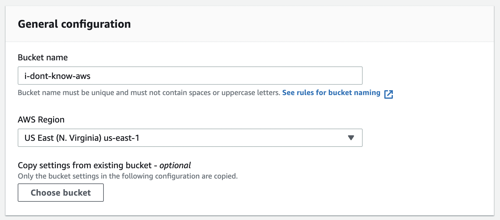

## Create CloudFront Distribution

https://console.aws.amazon.com/cloudfront/v3/home#/distributions/create

Choose the 3S bucket we just created fro "Origin domain" in the dropdown

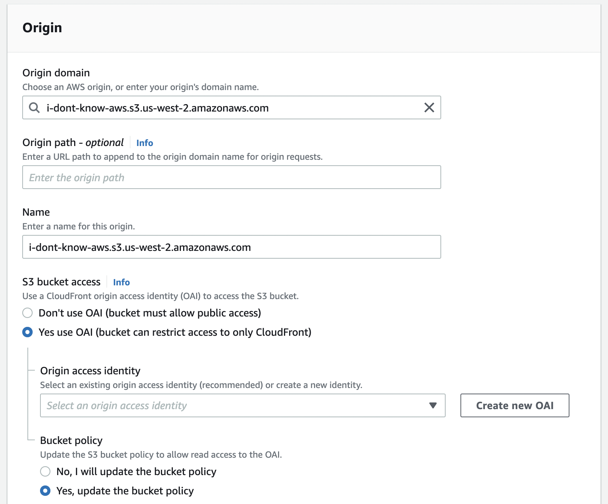

Check "Yes use OAI" & "Yes, update the bucket policy"

Fill Origin access identity by clicking "Create new OAI"

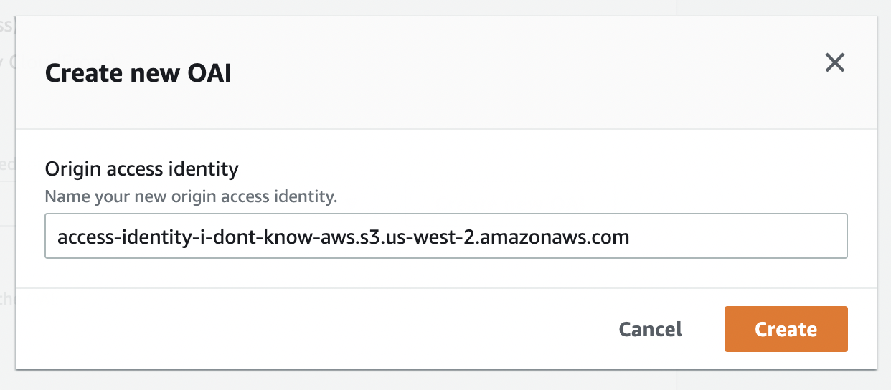

Redirect HTTP to HTTPS

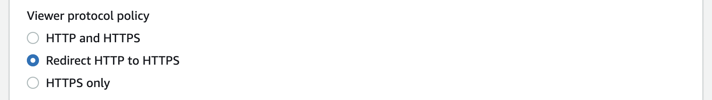

Set default root to `index.html`

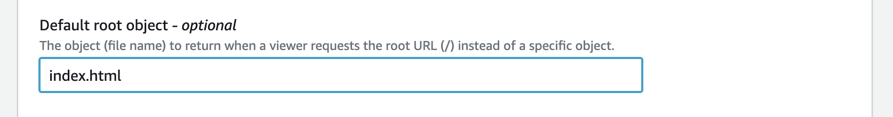

### Fast Preview

To validate the result faster without go throught the whole process, we can manually update assets (`/dist` in this case)to s3 bucket we just created. So that we can see the result from cloufront url.

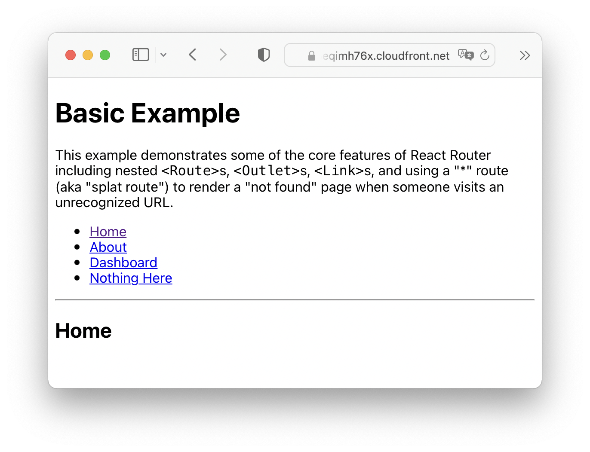

### Redirection for SPA

However, in the preview, we will find that `AccessDenied` happens if we visit `xxx.cloudfront/net/any-path`, because there is no assets for the path. To solve the problem we need to redirect all the request to `index.html`.

Go to "Error pages" tab in distribution detail page and "Create custom error reponse"

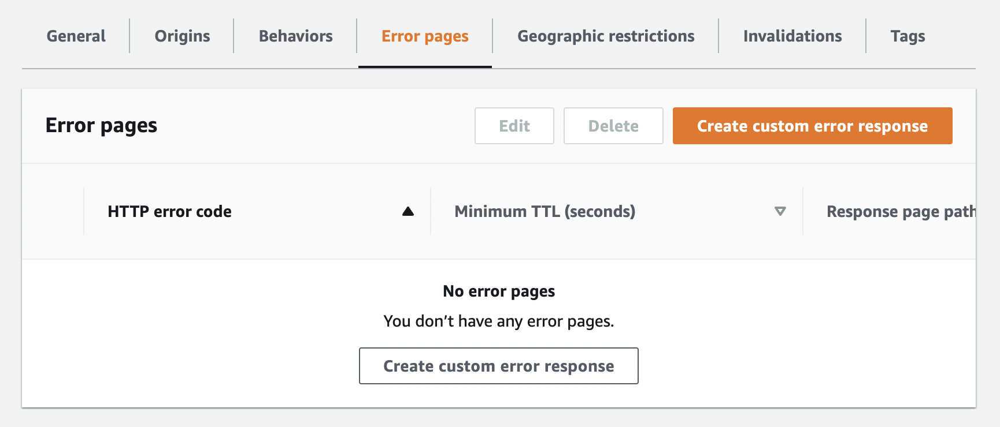

Redirect `403` to `/index.html` with `200`

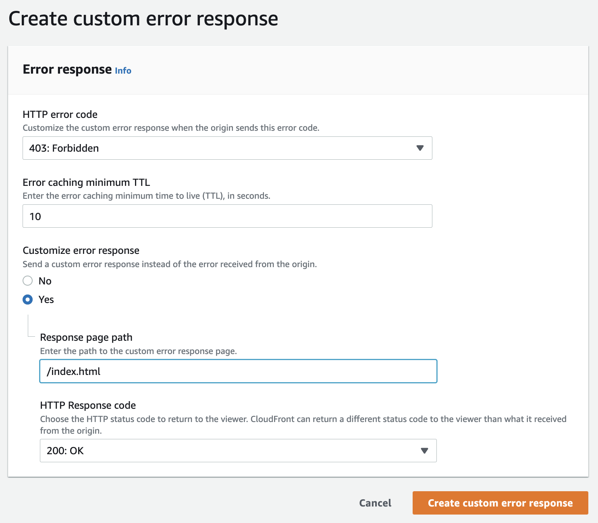

When the setting is done, `xxx.cloudfront/net/any-path` should be visible.

## Rrepare Policy & Root for GitHub Actions

Before configuring Github Actions Workflow, we need to create a root and policy for the CICD, which is [recommended](https://github.com/aws-actions/configure-aws-credentials#assuming-a-role) instead of using secret key and key id.

### Create a Policy

https://console.aws.amazon.com/iam/home#/policies$new?step=edit

Create a policy to allow `ListBucket` & `*Object` operations.

```json
{
  "Version": "2012-10-17",
  "Statement": [
    {
      "Sid": "ListObjectsInBucket",
      "Effect": "Allow",
      "Action": ["s3:ListBucket"],
      "Resource": ["arn:aws:s3:::<your-bucket-name>"]
    },
    {
      "Sid": "AllObjectActions",
      "Effect": "Allow",
      "Action": [
        "s3:GetObject",
        "s3:DeleteObject",
        "s3:PutObject",
        "s3:PutObjectAcl",
        "s3:GetObjectAcl"
      ],
      "Resource": ["arn:aws:s3:::<your-bucket-name>/*"]
    },
    {
      "Sid": "InvalidateCF",
      "Effect": "Allow",
      "Action": "cloudfront:CreateInvalidation",
      "Resource": "*"
    }
  ]
}
```

_You can use `*` for all the `Resource`, I just prefer setting it one by one._

### Create a Identity Provider

To connect AWS and Github, we need to define a identity provider first.

https://console.aws.amazon.com/iamv2/home#/identity_providers/create

- Choose "OpenID Connect"
- URL: `https://token.actions.githubusercontent.com`
- Audience: `sts.amazonaws.com`

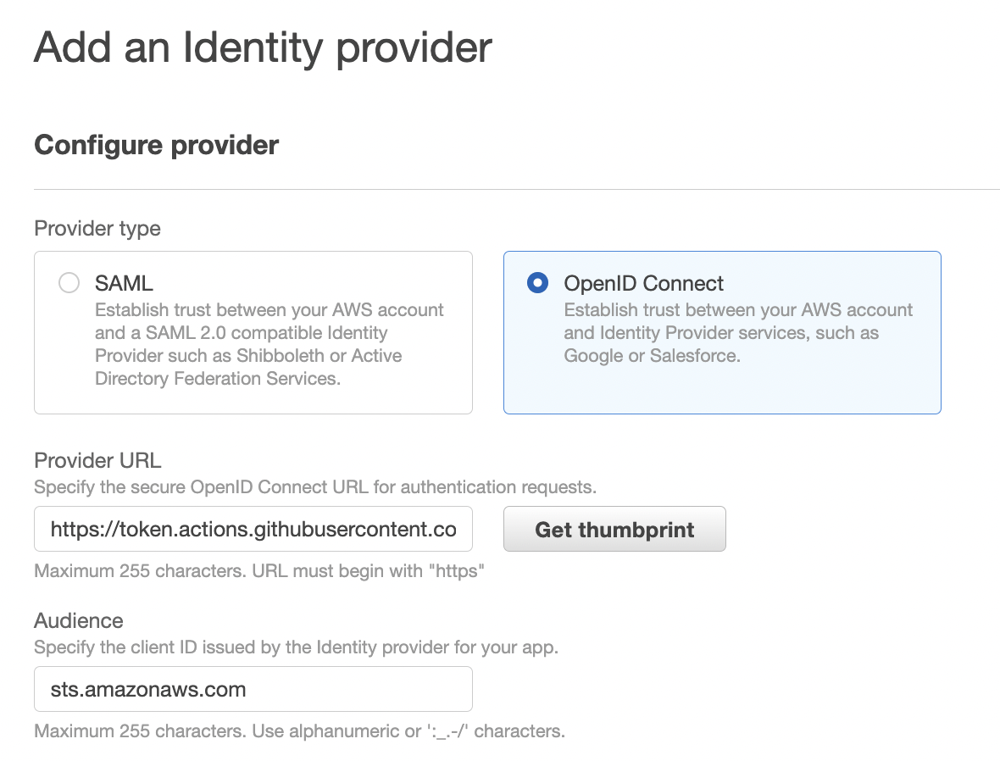

### Create a Root

https://console.aws.amazon.com/iamv2/home#/home

- Select "Web identity"
- Select identity provider and audience we just created

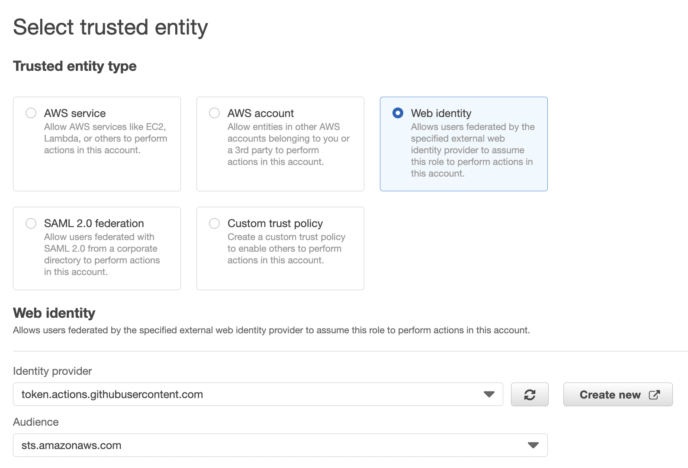

Select the [policy](#create-a-policy) we just created, which is named `front-end-deploy` in this case.

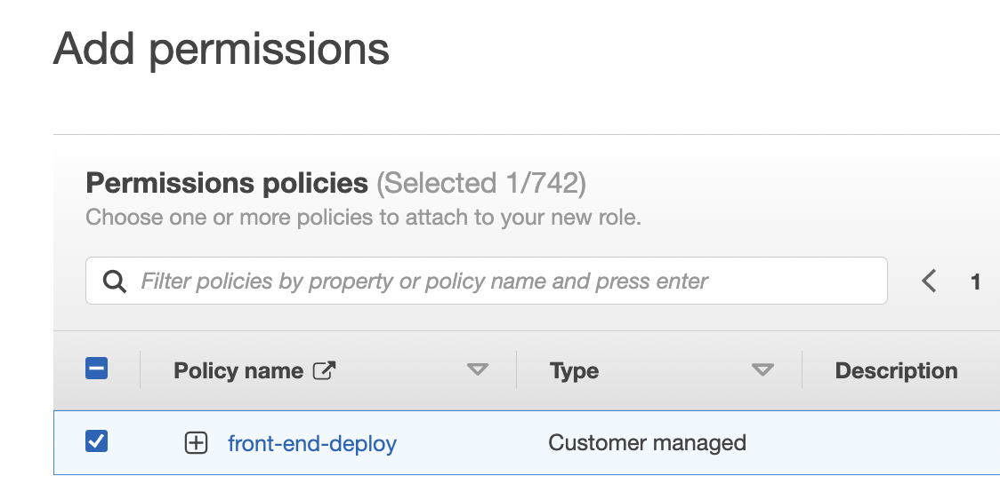

Now, we have a root named `github-actions`, which is able to `ListBucket` & operate `Object` according to the [policy](#create-a-policy) we just created

## Config Github Actions Workflow

```
mkdir -p .github/workflows
touch .github/workflows/main.yml
```

```yml
# ./github/workflows/main.yml
```

Set environment variables in `https://github.com/<username>/<repo>/settings/secrets/actions`

| Name               | Value                                     |
| ------------------ | ----------------------------------------- |
| AWS_REGION         | `us-west-2` (any region you set)          |
| AWS_ROLE           | `arn:aws:iam::<user-id>:role/<role-name>` |
| AWS_S3_BUCKET_NAME | `i-dont-know-aws`                         |
| CF_DISTRIBUTION_ID | `<distribution>`                          |

## Trigger Action

TODO...
